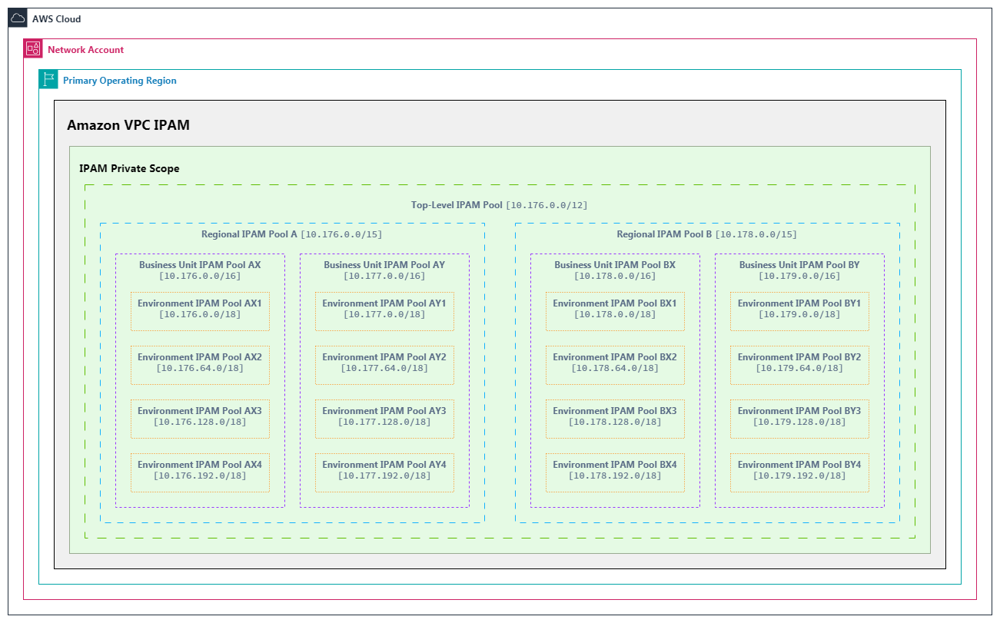

# Sample Terraform Implementation for Hierarchical IPAM on AWS

[![AWS][1]][1] [![Terraform][2]][2] [![Python][3]][3]

[1]: https://img.shields.io/badge/AWS-%23FF9900.svg?logo=amazon-web-services&logoColor=white&style=plastic
[2]: https://img.shields.io/badge/Terraform-%235835CC.svg?logo=terraform&logoColor=white&style=plastic
[3]: https://img.shields.io/badge/Python-3776AB?logo=python&logoColor=white&style=plastic

This solution provides code to implement a shared, multi-account, multi-region, hierarchical Amazon VPC IP Address Manager (IPAM) specification using Terraform. Alongside the included companion Streamlit web application (Python), AWS cloud architects, engineers, and/or developers can vastly accelerate VPC/network planning, IP address space visualization, and the eventual Terraform deployment of their Amazon VPC IPAM specification. The specification is shared with AWS Organizations using AWS Resource Access Manager (RAM), and guidance for potential use in other Terraform modules — e.g., with Account Factory for Terraform (AFT) — is provided within this repository's [README](#integration-patterns).

## Table of Contents

- [Executive Summary](#executive-summary)
- [Architecture Overview](#architecture-overview)
  - [What is IPAM?](#what-is-ipam)
  - [What is Amazon VPC IPAM?](#what-is-amazon-vpc-ipam)
  - [Core Architectural Concepts](#core-architectural-concepts)
- [Technical Design](#technical-design)
  - [Hierarchical Pool Structure](#hierarchical-pool-structure)
  - [Multi-Region Deployment Topology](#multi-region-deployment-topology)
  - [IPAM Compliance & Governance](#ipam-compliance--governance)
- [Implementation Guide](#implementation-guide)
  - [Prerequisites](#prerequisites)
  - [Configuration Parameters](#configuration-parameters)
  - [Deployment Workflow](#deployment-workflow)
  - [IPAM Configurator Tool](#ipam-configurator-tool)
- [Module Structure](#module-structure)
- [Deployed Resources](#deployed-resources)
- [Technical Features](#technical-features)
  - [Centralized Management](#centralized-management)
  - [Hierarchical IP Allocation](#hierarchical-ip-allocation)
  - [Resource Sharing & Integration](#resource-sharing--integration)
  - [Validation & Enforcement](#validation--enforcement)
  - [Resource Tagging](#resource-tagging)
- [Integration Patterns](#integration-patterns)
  - [AWS Organizations Integration](#aws-organizations-integration)
  - [AFT Integration](#aft-integration)
  - [VPC Provisioning Integration](#vpc-provisioning-integration)
- [Advanced Usage](#advanced-usage)
  - [Special Network Requirements](#special-network-requirements)
  - [Cross-Region Configurations](#cross-region-configurations)
- [Outputs Reference](#outputs-reference)
- [Security](#security)
- [License](#license)

---

## Executive Summary

This Terraform implementation provides a robust foundation for enterprise-grade IP address management across your AWS cloud infrastructure. By deploying a hierarchical, multi-region IPAM architecture integrated with AWS Resource Access Manager (RAM), it enables organizations to:

- **Automate IP address allocation** across regions, business units, and environments
- **Enforce organizational network policies** through programmatic validation
- **Scale network infrastructure** efficiently as business requirements evolve
- **Reduce operational overhead** through centralized management of IP address spaces
- **Accelerate cloud-native workload deployments** with self-service CIDR allocation
- **Prevent address conflicts** through policy-based controls and validation

This solution is designed for engineering teams who need to manage complex AWS environments with multiple accounts, regions, and business domains while maintaining consistent network governance.

<details>
  <summary><strong>Diagram:</strong> IPAM Deployment Topology & Example Usage</summary>


1. Developer is deploying a new VPC and requests a `/23` CIDR block from IPAM in Region `A`, for Business Unit `Y`, in Environment `3`.
2. The IPAM specification contains a pool for Region `A`, defined with the CIDR block of `10.176.0.0/15`.
3. Within the Region `A` pool, the specification contains a nested pool for Business Unit `Y` ("Pool `AY`"), defined as `10.177.0.0/16`.
4. Within "Pool `AY`", the specification contains another nested pool for Environment `3` ("Pool `AY3`"), defined as `10.177.128.0/18`.
5. Within the developer's target pool ("Pool `AY3`"), IPAM has two existing CIDR allocations — `10.177.128.0/23` and `10.177.130.0/22`. The next-available `/23` CIDR block is automatically calculated.
6. The next-available `/23` CIDR block is calculated as `10.177.134.0/23`, is provided for the developer's resource, and is automatically compliant with the IPAM specification (for "Pool `AY3`").

</details>

---

## Architecture Overview

### What is IPAM?

IP Address Management (IPAM) is how organizations plan, track, and manage IP address spaces. It’s essential for keeping networks organized, avoiding conflicts, and enforcing policies—especially as environments grow more complex.

<details>
  <summary>Common IPAM benefits</summary>

- Centralized visibility into address usage
- Automated assignment to prevent conflicts
- Hierarchical organization for governance
- Policy enforcement for compliance
- Integration with DNS and DHCP

</details>

### What is Amazon VPC IPAM?

Amazon VPC IPAM is a managed [**_feature_**](https://docs.aws.amazon.com/vpc/latest/ipam/what-it-is-ipam.html) (of Amazon VPC) that simplifies planning, tracking, allocating, and monitoring IP addresses for your AWS workloads. It replaces spreadsheets with automation and visibility, and is built for scale.

<details>
  <summary>Amazon VPC IPAM benefits checklist</summary>

- [x] Centralized management across accounts and regions
- [x] Automated CIDR allocation for VPCs and subnets
- [x] Hierarchical pools for organizational alignment
- [x] Integration with AWS Organizations and RAM
- [x] Near-real-time monitoring and audit trails

</details>

### Core Architectural Concepts

This solution uses several AWS constructs to organize and govern IP space:

| Concept             | Purpose                                         |
| ------------------- | ----------------------------------------------- |
| IPAM Service        | Central control, deployed in the primary region |
| IPAM Scopes         | Separate public and private address management  |
| IPAM Pools          | Hierarchical CIDR collections for allocation    |
| Pool Sharing        | Cross-account access via AWS RAM                |
| Resource Discovery  | Finds existing resources automatically          |
| Compliance Checking | Validates CIDR assignments against policies     |

<details>
  <summary><strong>Diagram:</strong> IPAM Logical Constructs</summary>



</details>

---

## Technical Design

### Hierarchical Pool Structure

By default, this solution is developed to employ a four-tier, nested pool hierarchy:

1. **Top-Level (Global) Pool**: Entire organizational IP space
2. **Regional Pools**: Allocations per AWS region, within the top-level pool
3. **Business Unit Pools**: Allocations per business unit/domain (marketing, finance), within each regional pool
4. **Environment Pools**: Allocations per "SDLC" environment (dev, qa, prod), within each business unit pool

<details>
  <summary><strong>Example:</strong> Hierarchical Structure</summary>

```
Top-Level Pool (10.0.0.0/8)
├── Regional Pool - us-east-1 (10.0.0.0/12)
│   ├── Business Unit - Finance (10.0.0.0/14)
│   │   ├── Environment - Dev (10.0.0.0/16)
│   │   ├── Environment - QA (10.0.2.0/16)
│   │   ├── Environment - Core (10.0.4.0/16)
│   │   └── Environment - Prod (10.0.6.0/16)
│   └── Business Unit - Marketing (10.0.8.0/14)
│       ├── Environment - Dev (10.0.8.0/16)
│       └── ... (additional environments)
└── Regional Pool - eu-west-1 (10.16.0.0/12)
    └── ... (additional business units and environments)
```

</details>

<details>
  <summary>Why this matters</summary>

- Every CIDR sits neatly inside its parent pool.
- No overlaps — each team gets its own space.
- Delegation is simple, but oversight stays centralized.
- Subnetting is straightforward and efficient.

</details>

### Multi-Region Deployment Topology

This solution deploys the IPAM service centrally in a primary region, while enabling management of additional AWS regions as operating regions. Each region receives a dedicated IPAM pool and is configured with locale-specific settings, which ensures efficient and centralized IP resource management across your AWS environment.

<details>
  <summary><strong>Table:</strong> Deployment Aspects</summary>

| Aspect                        | Description                                                                 |
| ----------------------------- | --------------------------------------------------------------------------- |
| **Primary Region Deployment** | IPAM service is deployed in a single primary region.                        |
| **Operating Regions**         | Additional regions registered for IPAM resource management.                 |
| **Regional Pool Assignment**  | Each operating region receives a dedicated address pool from the top-level. |
| **Cross-Region Management**   | All operating regions are centrally managed.                                |
| **Regional Locale Settings**  | Each regional pool has a "locale" property tied to its region.              |

</details>

### IPAM Compliance & Governance

This solution enables robust IP address compliance mechanisms by means of:

1. **Auto-Import**: When IPAM pools are created, it’s recommended to allow IPAM to automatically import pre-existing resources (into respective pools)
2. **Compliance Checking**: New and imported resources are monitored by IPAM for compliance with pool allocation rules and potential IP address overlap
3. **Nested Compliance**: Resources may be non-compliant with direct pools but compliant with higher-level pools
4. **Remediation Options**: Non-compliant resources can be excluded, reassigned, or have pools adjusted

As shown in the [deployment topology diagram](./img/IPAM_Conceptual-Visualizations_Deployment-Topology.png), VPC `AY3-3` demonstrates a non-compliance scenario where the resource's CIDR doesn't fit within the range of its intended pool.

For more information on CIDR compliance monitoring in Amazon VPC IPAM, please review the [documentation](https://docs.aws.amazon.com/vpc/latest/ipam/monitor-cidr-compliance-ipam.html).

---

## Implementation Guide

### Prerequisites

Before deploying this IPAM solution, ensure your environment meets these requirements:

1. **AWS Organizations**:

   - Your AWS environment must use AWS Organizations
   - The IPAM account must be a member of your organization
   - Resource sharing must be enabled at the organization level

2. **AWS Resource Access Manager (RAM)**:

   - Resource sharing must be enabled in your AWS Organization
   - For details: [AWS RAM Documentation](https://docs.aws.amazon.com/ram/latest/userguide/getting-started-sharing.html#getting-started-sharing-orgs)

3. **IAM Permissions**:

   - The deploying identity requires permissions for:
     - IPAM management
     - RAM resource sharing
     - Organization access
     - VPC management
   - For details: [AWS IPAM IAM Documentation](https://aws.amazon.com/blogs/networking-and-content-delivery/amazon-vpc-ip-address-manager-best-practices/)

4. **Service Quotas**:

   - Verify sufficient IPAM pool quota (default: 50)
   - This deployment with 6 regions, 2 business units, and 4 environments will create 67 pools
   - For details: [AWS IPAM Quotas](https://docs.aws.amazon.com/vpc/latest/ipam/quotas-ipam.html)

5. **Network Design**:

   - Prepare a comprehensive IP allocation plan
   - Confirm non-overlapping CIDR ranges for all regions, business units, and environments
   - For planning guidance: [AWS IPAM Planning](https://docs.aws.amazon.com/vpc/latest/ipam/planning-examples-ipam.html)

### Configuration Parameters

<details>
  <summary><strong>Expand details</strong></summary>

Key configuration parameters for this solution include:

1. **Top-Level CIDR**: The overall address space for your organization (e.g., `10.0.0.0/8`)
2. **Operating Regions**: AWS regions where IPAM will manage resources
3. **Regional IPAM Configurations**: Per-region settings including:
   - Regional names and descriptions
   - Regional CIDR allocations
   - AWS region locale
4. **Business Unit Configurations**: Per-BU settings including:
   - Business unit names and descriptions
   - BU-level CIDR allocations
5. **Environment Configurations**: Per-environment settings including:
   - Environment names and descriptions
   - Environment-level CIDR allocations
   - Reserved CIDR blocks

</details>

### Deployment Workflow

<details>
  <summary><strong>Expand details</strong></summary>

The deployment process follows this general workflow:

1. **Module Instantiation**: Include the IPAM module in your Terraform code
2. **Parameter Configuration**: Set required variables for your organization
3. **Validation**: Terraform validates CIDR relationships during plan phase
4. **IPAM Deployment**: Creates the IPAM service in the primary region
5. **Pool Creation**: Builds the hierarchical pool structure
6. **Resource Sharing**: Configures RAM sharing for cross-account access
7. **Outputs**: Produces references for downstream consumption

</details>

### IPAM Configurator Tool

To accelerate and simplify planning and deployment processes, I have developed a companion, Streamlit-based "**IPAM Configurator**" tool (located in the [ipam-figurator](./ipam-figurator/) directory) that helps generate the necessary `terraform.tfvars` file based on your organizational requirements.

This companion tool will prove essential once you have your Amazon VPC [network hierarchy](#hierarchical-pool-structure) planned — e.g., Top-Level CIDR, Operating Regions, Business Units, "SDLC" Environments. Here's a high-level overview of what the tool provides:

- **Interactive UI**: The configurator provides a web-based interface for defining your IPAM hierarchy
- **Automated CIDR Planning**: The tool calculates appropriate CIDR allocations based on your inputs
- **Visual Validation**: Preview the IPAM structure before generating the configuration
- **Configuration Download**: Export (or copy-paste) a ready-to-use `terraform.tfvars` file

To use the IPAM Configurator, clone the repo, change directories, then execute the `run.sh` script:

```bash
cd ipam-figurator
./run.sh
```

This will launch a local Streamlit application that will guide you through the configuration process. Once complete, you can download the generated `terraform.tfvars` file (or copy its contents) and use it with this Terraform module.

Once you have your '.tfvars' configuration, simply execute the `stop.sh` script to "tear-down":

```bash
./stop.sh
```

For more detailed information about the IPAM Configurator, see the [README](./ipam-figurator/README.md).

---

## Module Structure

The repository is organized with the following structure:

- **Root Module**: Orchestrates the deployment and provides input variables
- **IPAM Module**: Core implementation of the IPAM architecture
- **Tags Module**: Standardized tagging for all resources
- **IPAM Configurator**: Web-based tool for generating terraform.tfvars

Key files include:

- `main.tf`: Primary module orchestration
- `variables.tf`: Input variables for configuration
- `outputs.tf`: Output values for downstream consumption
- `data.tf`: Data sources for AWS resources
- `tags.tf`: Tagging configuration
- `modules/ipam/main.tf`: IPAM resource definitions
- `modules/ipam/locals.tf`: Validation logic and transformations
- `modules/tags/main.tf`: Tag standardization logic
- `ipam-figurator/`: IPAM configuration generation tool

---

## Deployed Resources

This solution deploys the following AWS resources:

1. **Core IPAM Resources**:

   - Amazon VPC IPAM instance in the primary region
   - IPAM scope for private IP management
   - Four-tier hierarchy of IPAM pools:
     - Top-level pool for global address space
     - Regional pools for each operating region
     - Business unit pools within each region
     - Environment pools within each business unit

2. **Resource Sharing**:

   - AWS RAM resource shares for all IPAM pools
   - RAM principal associations with your AWS Organization
   - RAM resource associations for all pools

---

## Technical Features

### Centralized Management

<details>
  <summary><strong>Expand details</strong></summary>

This solution deploys a single IPAM instance in your primary AWS region that:

- Provides a unified control plane for IP management
- Supports registration of multiple operating regions
- Centralizes logging and audit trails
- Offers consistent policy enforcement
- Maintains a single source of truth for IP allocation

</details>

### Hierarchical IP Allocation

<details>
  <summary><strong>Expand details</strong></summary>

The hierarchical pool structure enables:

- **Top-down address space planning**: Start with the largest scope and segment progressively
- **Delegation of control**: Business units can manage their allocations independently
- **Isolation of concerns**: Each pool has a dedicated purpose and owner
- **Efficient utilization**: CIDR blocks are allocated at appropriate sizes for their use

</details>

### Resource Sharing & Integration

<details>
  <summary><strong>Expand details</strong></summary>

AWS RAM integration provides:

- Cross-account access to IPAM pools
- Organizational-level permission management
- Self-service CIDR allocation for application teams
- Centralized policy enforcement with distributed execution

</details>

### Validation & Enforcement

<details>
  <summary><strong>Expand details</strong></summary>

Built-in validation logic ensures:

- Environment CIDRs are contained within their parent business unit CIDRs
- Business unit CIDRs are contained within their parent regional CIDRs
- Regional CIDRs are contained within the top-level CIDR
- No overlapping CIDRs within the same hierarchy level
- Proper mapping of environments to their respective business units

</details>

### Resource Tagging

This solution includes an additional, reusable [submodule](./modules/tags/README.md) to facilitate standardized tagging for all AWS resources.

---

## Integration Patterns

### AWS Organizations Integration

This solution integrates with AWS Organizations natively. By design, all IPAM pools are shared across all organization accounts using AWS RAM — from a dedicated `Network` account, for example, to which this solution's Terraform manifests were applied. Consequently, all accounts in the Organization will have the ability to apply consistent IP addressing standards.

### AFT Integration

For AWS Account Factory for Terraform (AFT) users, this solution might be used as an [Account Customization](https://docs.aws.amazon.com/controltower/latest/userguide/aft-account-customization-options.html) in your `Network` account (or similar).

This will help ensure:

1. You create and maintain a firm, centralized foundation for consistent network addressing for your accounts and workloads.
2. You are providing stable references for network resources provisioned using other AFT customizations/manifests (e.g., a [VPC module](#vpc-provisioning-integration)).

### VPC Provisioning Integration

This solution lets you plug IPAM-managed pools directly into your VPC provisioning workflow. Terraform modules for VPC resource provisioning can reference pools programmatically, enabling automatic CIDR allocation with consistent, centralized address management.

<details>
  <summary><strong>Code:</strong> Example VPC module integration</summary>

```hcl
# Data source to find the intended IPAM pool
data "aws_vpc_ipam_pool" "dev_pool" {
  filter {
    name   = "tag:Name"
    values = ["dev-environment-pool"]
  }
}

# Calling the VPC module
module "application_vpc" {
  source = "./modules/vpc"

  # Reference the intended IPAM pool
  ipam_pool_id        = data.aws_vpc_ipam_pool.dev_pool.id
  ipv4_netmask_length = 24  # Requests a /24 from the pool

  # Additional VPC configuration...
  name                = "dev-test-app-vpc"
  #...
}
```

</details>

<details>
  <summary>How this helps</summary>

1. VPCs get non-overlapping CIDRs, automatically assigned from the right pool
2. Address assignments are consistent and centrally tracked
3. No more manual subnet math or spreadsheet management

</details>

---

## Advanced Usage

### Special Network Requirements

For custom or edge-case scenarios, you can define configuration values directly within the module block -- i.e., via direct (inlined, explicit) values. The [IPAM Configurator](./ipam-figurator/) tool can generate the baseline configuration, which you can further tailor as needed.

<details>
  <summary><strong>Code:</strong> Example custom, partially-inlined configuration</summary>

```hcl
####### variables.tf #######
variable "additional_reg_ipam_configs" {
  description = "Additional regional IPAM configs"
  type        = map(object({
    name        = string
    description = string
    cidr        = list(string)
    locale      = string
  }))
  default     = {}
}
# ...etc.

####### terraform.tfvars #######
additional_reg_ipam_configs = {
  "us-west-2" = {
    name        = "ipam-regional-us-west-2"
    description = "Regional IPAM Pool for US West (Oregon)"
    cidr        = ["10.64.0.0/12"]
    locale      = "us-west-2"
  }
  # ...other regions
}
# ...etc.

####### main.tf #######
module "ipam" {
  source = "./modules/ipam"

  # Inlined (explicit) values for custom requirements
  operating_regions = [
    "us-east-1",
    "us-west-2",
    "eu-west-1",
    "ap-northeast-1"
  ]
  top_name        = "enterprise-ipam-global"
  top_description = "Enterprise-wide Global IPAM Pool"

  # Partially-inlined: 'us-east-1' is inlined, others via 'merge()' with the new 'var.additional_reg_ipam_configs'
  reg_ipam_configs = merge(
    {
      us-east-1 = {
        name        = "ipam-regional-us-east-1"
        description = "Regional IPAM Pool for US East (N. Virginia)"
        cidr        = ["10.0.0.0/10"]
        locale      = "us-east-1"
      }
    },
    var.additional_reg_ipam_configs
  )

  # Inhereted defaults or shared values from existing variables
  top_cidr          = var.top_cidr
  bu_ipam_configs   = var.bu_ipam_configs
  env_ipam_configs  = var.env_ipam_configs
  organization_arn  = data.aws_organizations_organization.current.arn
  share_name        = var.share_name
  tags              = module.tags.tag_map
}
```

> [!TIP]
> Terraform does not support "spreading" maps — e.g., like JavaScript's `{ ...var }`. So, as illustrated in my "partially-inlined" example (for `reg_ipam_configs`) above, I needed to declare a new variable (`additional_reg_ipam_configs`) in the `variables.tf` file, assign a value to the variable (or value**s**, since `additional_reg_ipam_configs` is a map) in the `terraform.tfvars` file, and use `merge()` to combine the inlined and variable-driven maps.

See the [example tfvars file](./terraform.tfvars.example) for additional insights into fully specified arguments.

</details>

---

## Outputs Reference

This solution provides comprehensive outputs by default — e.g., for downstream consumption:

1. **IPAM Pool IDs**:

   - Top-level pool ID
   - Regional pool IDs
   - Business unit pool IDs
   - Environment pool IDs

2. **CIDR Allocations**:

   - Business unit CIDR blocks
   - Environment CIDR blocks

3. **RAM Resources**:

   - Resource share ARNs
   - Principal associations
   - Resource associations

---

## Security

See [CONTRIBUTING](CONTRIBUTING.md#security-issue-notifications) for more information.

---

## License

This library is licensed under the MIT-0 License. See the LICENSE file.
