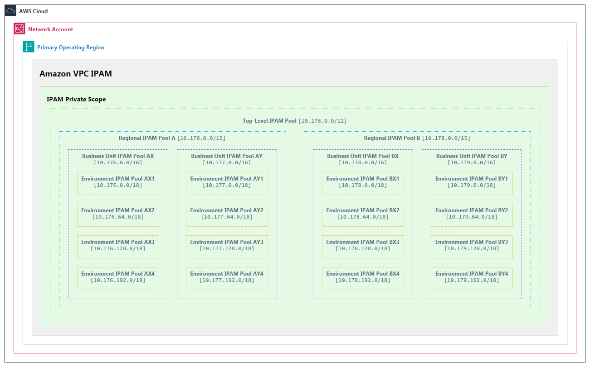

# AWS IPAM Configurator

[![AWS][1]][1] [![Terraform][2]][2] [![Python][3]][3]

[1]: https://img.shields.io/badge/AWS-%23FF9900.svg?logo=amazon-web-services&logoSize=auto&style=plastic&logoColor=white
[2]: https://img.shields.io/badge/Terraform-%235835CC.svg?logo=terraform&logoSize=auto&style=plastic&logoColor=white
[3]: https://img.shields.io/badge/Python-3776AB?logo=python&logoSize=auto&style=plastic&logoColor=white

A local, streamlined Streamlit web application for generating Terraform configuration for AWS IP Address Manager (IPAM) with hierarchical pools.

Oversimplified example of a multi-tiered IPAM topology:



## Overview

This tool helps network architects and infrastructure engineers create properly structured CIDR allocations for multi-region, multi-business unit, multi-environment deployments in AWS. It addresses the challenges of IP address planning by automating the calculation of appropriate CIDR ranges based on organizational requirements.

The generator creates a hierarchical structure with:

1. **Top-Level Pool**: Global IP space for your organization
2. **Regional Pools**: Subdivided by AWS region
3. **Business Unit Pools**: Further subdivided for different business units
4. **Environment Pools**: The most granular level for development, testing, production, etc.

## Key Features

- **Interactive Web Interface**: Visual configuration of IPAM structure with real-time validation
- **Automated CIDR Calculation**: Intelligent subnet allocation with proper containment and hierarchy
- **Visual Representation**: Sunburst diagram and tabular visualization of IP address allocation
- **Terraform Output Generation**: Produces ready-to-use `terraform.tfvars` for the IPAM Terraform module
- **Customizable Hierarchy**: Options to include or exclude Business Unit and Environment levels
- **Resource Ordering**: Drag-and-drop interface for ordering regions, business units, and environments
- **Reserved Space Management**: Configure reserved space within environment pools using percentage or half-split strategies
- **Advanced Configuration**: Fine-tune subnet sizes and allocation strategies

## Installation

### Prerequisites

- Python 3.7+
- pip3

### Setup

1. Clone this repository:

   ```bash
   git clone https://github.com/donsch/ipam-figurator.git
   cd ipam-figurator
   ```

2. Install the required dependencies:

   ```bash
   pip install -r requirements.txt
   ```

### Quick Start

1. Start the Streamlit application:

   ```bash
   ./run.sh
   ```

   Alternatively, run it directly with:

   ```bash
   streamlit run app.py
   ```

2. Access the application in your web browser (typically at http://localhost:8501)

## Using the Application

### 1. Configuration Tab

1. **Define Top-Level CIDR**: Enter the primary CIDR block for your organization (e.g., 10.0.0.0/8)
2. **Configure Pool Hierarchy**: Choose which levels to include (Business Units, Environments)
3. **Select AWS Regions**: Choose primary and secondary regions for deployment
4. **Define Business Units**: Enter names for your organizational divisions (if BU level is included)
5. **Define Environments**: Specify environments like prod, dev, qa (if environment level is included)
6. **Advanced Options**: Configure subnet sizes and reserved space strategies
7. **Generate Configuration**: Calculate the IPAM structure based on your inputs

### 2. Organization Tab

1. Reorder regions, business units, and environments to control CIDR allocation precedence
2. Use the up/down arrows to change the order of items
3. Recalculate to apply the new ordering to your IPAM configuration

### 3. Visualization Tab

1. View a comprehensive IP address allocation overview
2. Interact with the sunburst diagram to explore the hierarchy
3. Review detailed tables of CIDR allocations at each level

### 4. Terraform Output Tab

1. Copy the generated Terraform variables for use with the IPAM module
2. Download the complete `terraform.tfvars` file
3. Review module modifications if necessary for your hierarchy configuration

## Technical Information

### Architecture

The application consists of the following components:

- **app.py**: Main Streamlit interface
- **ipam_logic.py**: Core CIDR calculation and Terraform output generation
- **utils.py**: Helper functions for visualization and formatting
- **requirements.txt**: Python dependencies

### CIDR Calculation Process

1. **Validation**: The tool validates input parameters for logical consistency
2. **Hierarchical Allocation**: Calculates appropriate subnet sizes based on number of regions, BUs, and environments
3. **Ordering**: Respects user-defined ordering for allocation precedence
4. **Reserved Space**: Allocates reserved space within environment pools based on selected strategy

### Terraform Integration

The output from this generator is designed to work with the accompanying Terraform module for AWS IPAM deployment. The module creates:

- Amazon VPC IPAM instance
- Hierarchical IP address pools
- AWS Resource Access Manager (RAM) shares for cross-account access

## Troubleshooting

- **Insufficient CIDR Space**: If you receive an error about insufficient space, try using a larger top-level CIDR or reducing the number of regions/BUs/environments
- **Browser Issues**: If the UI behaves unexpectedly, try clearing your browser cache or using a private/incognito window
- **Application Crashes**: Check that you have the correct Python version and all dependencies installed

## Maintenance

To stop the application and clean up resources:

```bash
./stop.sh
```

## Security

See [CONTRIBUTING](../CONTRIBUTING.md) for more information.

## License

This project is licensed under the MIT-0 License. See the [LICENSE](../LICENSE) file for details.
